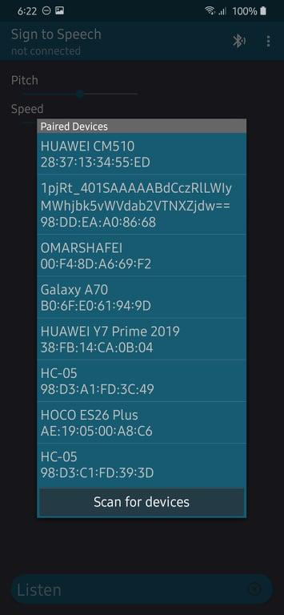
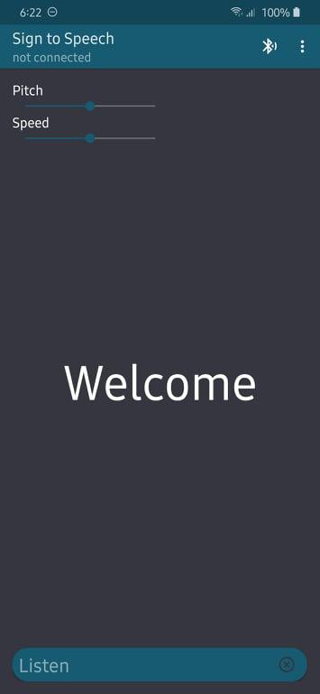
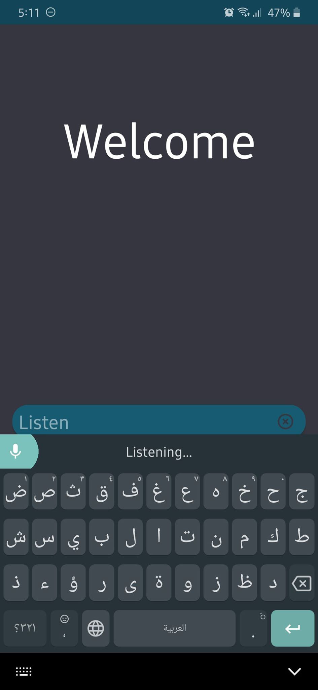

# Sign-Language-Glove
We made a glove that takes the sign of the hand using a microcontroller, translate it to a text, send this text via Bluetooth to a mobile app to be shown in the app, and saidWe made a glove that takes the sign of the hand using a microcontroller(ATmega32), translates it to a text, sends this text via Bluetooth to a mobile app to be shown on the screen, and spoken.
# Hardware Components
ATmega32 Micro-controller

Flex Sensor

HC05 Bluetooth Module

Resistors

Capacitors

Regulator(5V)

Battery

Crystal Oscillator

Glove

# Android App
https://github.com/OmarShafei-coder/SignToSpeech
# Resources
Mazidi AVR book

ATmega32 Datasheet

https://www.youtube.com/watch?v=DoYnz0GYN1w&t=11s

https://www.javatpoint.com/java-tutorial

https://www.tutorialspoint.com/android/android_text_to_speech.htm

https://developer.android.com/guide/topics/connectivity/bluetooth

https://github.com/android/connectivity-samples/tree/master/BluetoothChat

https://www.learnhowtoprogram.com/android/introduction-to-android/introduction-to-xml-and-android-layouts

# Screenshots

   

   

